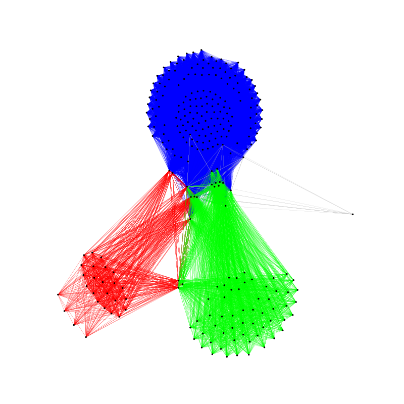
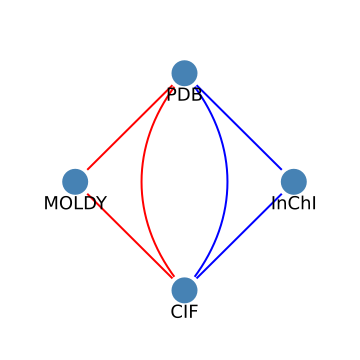

# Conversion Chaining

## Motivation

The goal of this project is to provide a one-stop for conversion between the hundreds of file formats used in chemistry to describe molecular structure. This is done in part by using existing converters as plugins and allowing the user to pick a converter which can perform a desired conversion.

However, there are many pairs of formats where no direct conversion is possible, and we aim to handle this through chained conversions using multiple converters. This presents the problem: How do we determine possible chained conversions? And having determined these possible conversions, how do we determine the best one to use?

To answer this question, it helps to reframe the problem in terms of the mathematical structure known as the "graph", in particular the [directed graph](https://en.wikipedia.org/wiki/Directed_graph) (since there are some cases where conversion is only allowed in one direction - an example being the [InChIKey format](https://en.wikipedia.org/wiki/International_Chemical_Identifier#InChIKey), which is a hashed representation and thus can only be converted to, but not from), with formats represented as vertices and conversions as edges. Existing packages such as `igraph` allow us to take advantage of pre-existing code to solve problems such as this rather than needing to write our own from scratch.

The full graph of formats and allowed conversions looks like the following, with black dots representing different formats and different edge colors representing different converters performing each conversion:



We can see from this that most formats are only supported by one converter, with only a handful being supported by more than one. This underlines the necessity of supporting chained conversions, as a random pair of two formats will not be supported by a direct conversion more often than not.

## Deciding an optimal path

### General pathfinding

Rather than tackling this full graph, let's look at a much smaller, more manageable subset it, with just four supported formats:



This graph shows four formats: MOLDY, PDB, CIF, and InCHi. PDB and CIF are supported by both the Atomsk (red) and Open Babel (blue) converters, while MOLDY is supported only by Atomsk and InCHi is supported only by Open Babel.

A user who wished to convert from MOLDY to InCHi would thus face a problem here, that no converter can perform this conversion directly. Our goal then is to determine a possible path the user could take. Looking at this graph, it's easy to intuit that there are two possible reasonable paths:

1. Convert from MOLDY to PDB with Atomsk, then from PDB to InCHi with Open Babel
2. Convert from MOLDY to CIF with Atomsk, then from CIF to InCHi with Open Babel

But with a much larger graph, it won't always be so easy to find a path. And in fact, even in this case, these are just the most obvious paths to a human. An exhaustive search would see many more paths, such as:

3. Convert from MOLDY to PDB with Atomsk, then from PDB to CIF with Atomsk, then from CIF to InCHi with Open Babel
4. Convert from MOLDY to CIF with Atomsk, then from CIF to PDB with Open Babel, then from PDB to InCHi with Open Babel

If we don't put in a constraint to avoid retracing one's steps, the number of paths is in fact infinite, but even without that constraint we see that a computer will pick up on many paths which are obviously suboptimal.

This is a common problem faced when working with graphs, with the most common real-world example of this coming up being pathfinding, i.e. finding directions from one location to another. Let's use this as an analogy to show how we would determine an optimal path.

We'll consider here four locations (analogous to the formats): New York, London, Edinburgh, and Oxford. There are flight connections between all of New York, London, and Edinburgh, and it's possible to drive between all of London, Edinburgh, and Oxford.

So our analogous pathfinding problem to the format conversion problem above would someone who wishes to travel from New York to Oxford. This can't be done solely by flying or by driving, but can be done with a hybrid of the two. However, which path is best depends on what the goal is. Let's say the goal is purely to minimise travel time. The travel times between each location are:

- New York and London (flight): 7 hours
- New York and Edinburgh (flight): 6 hours
- London and Edinburgh (flight): 1 hour
- London and Edinburgh (driving): 8 hours
- London and Oxford (driving): 2 hours
- Edinburgh and Oxford (driving): 7 hours

An exhaustive search of all paths that don't retrace their steps would find here that the fastest route is New York to London by flight (7 hours), then London to Oxford by driving (2 hours).

But an exhaustive search isn't reasonable with larger maps, as the number of possible routes scales exponentially with the number of vertices (`O(e^V)` time). Luckily, this is a solved problem in graph theory, and modern implementations of [Dijkstra's_algorithm](https://en.wikipedia.org/wiki/Dijkstra%27s_algorithm) can find the optimal route in `O(E + V log(V))` time (where E is the number of edges and V is the number of vertices), making the problem easily tractable for a graph of the size we're working with.

### Determining pathfinding weights

In the above example, we chose time as the relevant property we wanted to minimise in pathfinding, but of course we could have chosen something else, such as price, and minimised that instead. The chosen quantity is referred to as the "weight" of a path in the general case. Dijkstra's algorithm functions with any set of unbounded non-negative weights, even if they don't follow intuitive physical properties such as the [triangle inequality](https://en.wikipedia.org/wiki/Triangle_inequality), i.e. it's allowable for A->B to have a greater weight than the sum of A->C and C->B.

But what if we want multiple factors to be relevant, or what if there are other constraints we need to abide by, or wish to abide by if at all possible?

This is in fact the case we're dealing with when it comes to format conversions. Without getting into the details yet of what these mean, the goals we have are, in descending order of priority:

1. Don't follow a path which loses and then re-extrapolates any type of data shared by both the input and output format

2. Minimise loss of numerical accuracy (e.g. floating-point values being truncated in the conversion process)

3. Minimise time (implicitly minimising the number of steps)

Dijkstra's algorithm requires only one weight per path, so we have to find some way to combine these aspects.

#### Weighted combination

The most straightforward way to have only one weight per path is to calculate it a weighted combination of the relevant factors, e.g.:

```math
\displaystyle W_i = w_{x}x_i + w_{y}y_i + w_{z}z_i
```

where $W_i$ is the total weight assigned to edge $i$ and $w_x$, $w_y$, and $w_z$ are the relative weights of factors $x$, $y$, and $z$ respectively. So we could for instance assign the highest weight to the most important factor, etc.

But the situation here is actually a bit more complicated. We don't simply wish for some of these factors to be weighted more, we wish for them to be strictly more important - no increase in factor $x$ can be compensated for by any decrease in $y$ or $z$. To use the travelling example, we could say that the high-importance factor is whether or not the traveller's luggage is permitted on the route, and the low-importance factor is how jostled the luggage will be in trip. Obviously if the luggage can't make the trip at all, it doesn't matter how smooth a ride it will have.

Strictly speaking, this can't be accomplished with a weighted combination, as no matter how different the weights are, there could always be extreme cases where the weight is overcome. This might occur rarely enough that it gives an acceptably low rate of error though, so we'll pin this possibility while we investigate if other solutions are worthwhile.

#### Tiered pathfinding

In the example here of losing one's luggage, this is a binary event - either the condition of keeping one's luggage through the trip is satisfied or it isn't. With this binary condition, there isn't likely to be a single best path, but rather many paths which fulfill this criterion equally.

Pathfinding algorithms are capable of handling cases like this where there are many equally-good paths, so what we can do with this is, we can implement two stages of pathfinding. The first looks only at the high-importance criteria and identifies only the paths which satisfy it. The second stage looks at the second criteria and only the paths determined valid in the first step, and minimises the weight through these paths using the second criteria.

The fact that the high-importance criteria isn't binary actually isn't necessary for this solution. Instead of searching for all pathways which satisfy the condition, we can instead search for all pathways which minimise it to the same greatest extent.

This has the advantage over the previous approach that it will guarantee that the strict relative importance of the criteria is respective, but it comes with the drawback of greater computational overhead, needing to run the pathfinding algorithm multiple times (or else running some analogous operation on the list of shortest pathways from the first step such as a sort). This will also get more complicated to program if there are more than two importance tiers.

#### Custom weight type

It's possible to run the pathfinding in a single stage with strict tiering of criteria if we use a custom data type for the weights of paths. The only requirements that Dijkstra's algorithm places on the weights is that they be non-negative, addable, and comparable. It's possible to construct a data type which meets these criteria and also allows for strict importance tiering, and in fact such a type is already in use for version numbering.

Version numbers are period-separated integers such as 0.1, 1.245.0, 0.2.40, etc. A difference in a more-major (earlier) number always takes precedence in a comparison over any difference in a less-major number, i.e. (X+1).0 is greater than X.Y for any value of Y, no matter how large, e.g. 1.0.0 is greater than 0.999999.0.

A number system such as this could be used for pathfinding with tiered importance simply by setting up appropriate weights, e.g.:

- Weight for luggage being allowed at all on the trip: 1.0.0
- Weight for time in hours of the trip: 0.2.0
- Weight for price in $100 for the trip: 0.1.0
- Weight for how jostled the luggage gets in the trip: 0.0.1

A single pathfinding algorithm could then be run, which will prioritise trips where luggage is allowed. Among those where it is (or among all if it isn't allowed on any route), it will balance time and price. If there are multiple best paths which tie on this as well, it will then prioritise whichever jostles the luggage the least.

This solution keeps the programming of the pathfinding simple (the extra complexity going into the definition of the data type), but will slow it down as comparisons of a custom data type such as this will take longer than native types, as compilers, hardware etc. are optimised for native numerical types. This also has the issue that if a third-party library is used for the pathfinding, it isn't likely to support a custom data type for weights. For instance, the `igraph` library only supports integer and floating-point weights.

### Optimal approach for our task

#### Nature of the problem

To determine which approach is best for our task, let's now get into the details of what we need to do.

A chemical file format can store various types of information, of which we currently keep track of four, listed here in descending order of importance:

1. **Composition**: What elements make up the chemical (there are in fact some formats which don't store this information, such as [InChIKey](https://en.wikipedia.org/wiki/International_Chemical_Identifier#InChIKey))
2. **Connections**: Which atoms in the chemical are bonded to which other atoms
3. **Coordinates**: The physical locations of the atoms relative to each other. Some formats provide a full 3D information, while others only provide 2D information. To keep track of which is supported, our database lists 2D Coordinates and 3D Coordinates separately

At present, our database stores whether or not each of these properties is supported for many, but not all formats, listing the status as unknown for the remainder. While of course ideally this information should be added to the database, in the meantime it's an issue we need to take into account.

When a format is converted to another which is capable of storing more information than the source format, this information will either be excluded or extrapolated, depending on the specific scenario.

Different formats also store numeric information at different precisions (i.e. the number of digits), so a conversion to a format with lesser precision will result in some data loss. Even between formats with the same precision in theory, data loss may occur if it's represented differently (e.g. a point in 2D space could be described by its $x$ and $y$ coordinates or $r$ and $\theta$, and a conversion between the two will lose a small amount of information due to rounding at the final step), so it's safest to assume a small loss of information with every conversion.

All else being equal, the time to perform a conversion is also relevant.

For all considerations here aside from time, we also have to keep in mind whether the source and target format support this information or precision. For instance, consider three cases:

1. Format A (9-digit precision) -> Format B (9-digit precision) -> Format C (4-digit precision) -> Format D (9-digit precision)

2. Format E (4-digit precision) -> Format B (9-digit precision) -> Format C (4-digit precision) -> Format D (9-digit precision)

3. Format A (9-digit precision) -> Format B (9-digit precision) -> Format C (4-digit precision) -> Format F (4-digit precision)

Consider here the conversion from Format B to Format C, which goes from 9-digit precision to 4-digit precision. What should the weight be for the loss of data precision? In case 1, where the source format has 9-digit precision, this is the first step to lose that precision, and so should be weighted high to reflect this.

However, in case 2, the source format only has 4-digit precision, so although it's converted into a format with greater precision, it never actually has this precision to lose in the conversion from B to C, so it shouldn't be given a weight penalty for this. Case 3 shows the opposite issue: Although the source format does lose precision in this step, the target format doesn't support this precision, so the loss is inevitable and will have to happen at some point.

This leads to an important conclusion about this problem: Edge weights are not independent, instead being dependent on the source and target formats. In particular, we can say that a weight for losing information should be applied only if both the source and target format share that information (or level of precision).

If we want to be particularly careful, we should also say that this weight should only be applied the first time this information is lost along a pathway. This is difficult to implement though as it would mean that an edge would have a different weight depending on the path taken to get to its source vertex, which is not standard and would require a completely different pathfinding algorithm. However, this would require a particularly long chain of conversions - which is unlikely to occur - and the impact if it did would not be significant - an already dispreferred path would be even more dispreferred - so the amount of work needed to implement this would not nearly be justified.

#### Constraint summary

Putting this all together, we have the following list of properties to weight, in descending order of importance:

1. Composition
2. Connections
3. 2D Coordinates
4. 3D coordinates
5. Numerical precision
6. Conversion time

With the following notes:

- We want to apply this importance strictly - e.g. a faster conversion isn't worth losing numerical precision
- We should always apply a small weight to numerical precision for each conversion to be on the safe side
- Not all formats currently list what information they support
- Any loss of information should only be weighted if both the source and target format support this information, and similarly with numerical precision

#### Our approach

Let's look again at the graph of all conversions:


Note that the vast majority of formats are supported by only one converter, with only a small number of formats being supported by more than one and acting as bridges. Converters also tend to support any-to-any conversions of formats they support, with the only exceptions being some formats they can only convert from, and others they can only convert to.

This implies that in the vast majority of cases, conversion chains will be short, likely with two intermediate formats at most, and typically just one. And since there are only a relative few formats that can act as bridges, any filter on equally-short pathways (however "short" is defined) is going to result in a relatively small number of pathways.

Since any initial filter will reduce the number of potential pathways so much, the additional computational overhead cost of the tiered pathfinding approach will be minimal. Meanwhile, with so many different factors to consider, the weighted combination approach could become unwieldy. Either solution is probably workable, but it seems like the tiered pathfinding approach is best here.

The approach we'll take is thus the following:

1. Choose the most important property that hasn't already been used, starting with Composition
2. If both the source and target format don't share this property (for the types of information), go back to step 1 with the next property. If the status of the property is unknown for the source or target format, assume they _do_ support it to be on the safe side
3. Assign weights to all edges, based on the following determination:
4. If we're working with a type of information, assign a weight of 1 if this is lost in this conversion. If the status of the property is unknown in either format involved in this conversion, assume that they _don't_ support it to be on the safe side
5. If we're working with numerical precision, assign a weight of 1 plus the number of digits of precision lost in the conversion, minimum 1 if no digits are lost or some are gained
6. If we're working with time, assign a weight of the average conversion time in milliseconds
7. Run the pathfinding algorithm to find a set of all equally-short paths
8. If no path is returned, the conversion is impossible, so indicate that. If only one path is returned, return that path
9. Unless this is the final property, create a new graph featuring only formats that appear in one of the shortest paths and their possible conversions, then return to step 1 and continue this process on the next-most-important property
10. If this is the final property and more than one path has been found to be equally short, return whichever is first in the list
