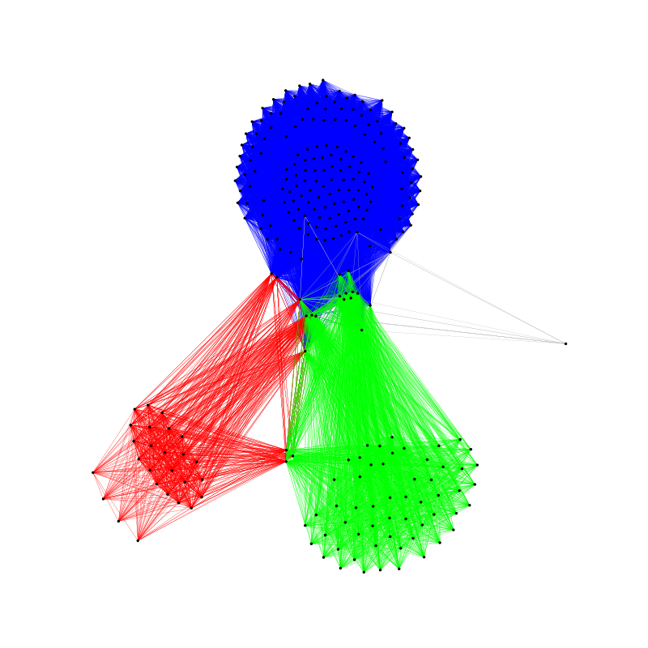
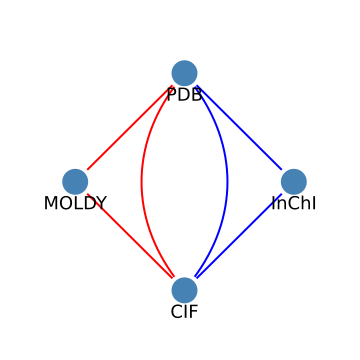

# Conversion Chaining

## Motivation

The goal of this project is to provide a one-stop for conversion between the hundreds of file formats used in chemistry to describe molecular structure. This is done in part by using existing converters as plugins and allowing the user to pick a converter which can perform a desired conversion.

However, there are many pairs of formats where no direct conversion is possible, and we aim to handle this through chained conversions using multiple converters. This presents the problem: How do we determine possible chained conversions? And having determined these possible conversions, how do we determine the best one to use?

To answer this question, it helps to reframe the problem in terms of the mathematical structure known as the "graph", in particular the [directed graph](https://en.wikipedia.org/wiki/Directed_graph) (since there are some cases where conversion is only allowed in one direction - an example being the [InChIKey format](https://en.wikipedia.org/wiki/International_Chemical_Identifier#InChIKey), which is a hashed representation and thus can only be converted to, but not from), with formats represented as vertices and conversions as edges. Existing packages such as `igraph` allow us to take advantage of pre-existing code to solve problems such as this rather than needing to write our own from scratch.

The full graph of formats and allowed conversions looks like the following (at time of writing this document - it's probably gotten more complicated since!), with black dots representing different formats and different edge colors representing different converters performing each conversion:



We can see from this that most formats are only supported by one converter, with only a handful being supported by more than one. This underlines the necessity of supporting chained conversions, as a random pair of two formats will not be supported by a direct conversion more often than not.

## General pathfinding

Rather than tackling this full graph, let's look at a much smaller, more manageable subset it, with just four supported formats:



This graph shows four formats: MOLDY, PDB, CIF, and InCHi. PDB and CIF are supported by both the Atomsk (red) and Open Babel (blue) converters, while MOLDY is supported only by Atomsk and InCHi is supported only by Open Babel.

A user who wished to convert from MOLDY to InCHi would thus face a problem here, that no converter can perform this conversion directly. Our goal then is to determine a possible path the user could take. Looking at this graph, it's easy to intuit that there are two possible reasonable paths:

1. Convert from MOLDY to PDB with Atomsk, then from PDB to InCHi with Open Babel
2. Convert from MOLDY to CIF with Atomsk, then from CIF to InCHi with Open Babel

But with a much larger graph, it won't always be so easy to find a path. And in fact, even in this case, these are just the most obvious paths to a human. An exhaustive search would see many more paths, such as:

3. Convert from MOLDY to PDB with Atomsk, then from PDB to CIF with Atomsk, then from CIF to InCHi with Open Babel
4. Convert from MOLDY to CIF with Atomsk, then from CIF to PDB with Open Babel, then from PDB to InCHi with Open Babel

If we don't put in a constraint to avoid retracing one's steps, the number of paths is in fact infinite, but even without that constraint we see that a computer will pick up on many paths which are obviously suboptimal.

This is a common problem faced when working with graphs, with the most common real-world example of this coming up being pathfinding, i.e. finding directions from one location to another. Let's use this as an analogy to show how we would determine an optimal path.

We'll consider here four locations (analogous to the formats): New York, London, Edinburgh, and Oxford. There are flight connections between all of New York, London, and Edinburgh, and it's possible to drive between all of London, Edinburgh, and Oxford.

So our analogous pathfinding problem to the format conversion problem above would someone who wishes to travel from New York to Oxford. This can't be done solely by flying or by driving, but can be done with a hybrid of the two. However, which path is best depends on what the goal is. Let's say the goal is purely to minimise travel time. The travel times between each location are:

- New York and London (flight): 7 hours
- New York and Edinburgh (flight): 6 hours
- London and Edinburgh (flight): 1 hour
- London and Edinburgh (driving): 8 hours
- London and Oxford (driving): 2 hours
- Edinburgh and Oxford (driving): 7 hours

An exhaustive search of all paths that don't retrace their steps would find here that the fastest route is New York to London by flight (7 hours), then London to Oxford by driving (2 hours).

But an exhaustive search isn't reasonable with larger maps, as the number of possible routes scales exponentially with the number of vertices (`O(e^V)` time). Luckily, this is a solved problem in graph theory, and modern implementations of [Dijkstra's_algorithm](https://en.wikipedia.org/wiki/Dijkstra%27s_algorithm) can find the optimal route in `O(E + V log(V))` time (where E is the number of edges and V is the number of vertices), making the problem easily tractable for a graph of the size we're working with. We can thus rely on `igraph`'s implementation of Dijkstra's algorithm for our purposes rather than needing to reinvent the wheel here.

## Determining pathfinding weights

In the above example, we chose time as the relevant property we wanted to minimise in pathfinding, but of course we could have chosen something else, such as price, and minimised that instead. The chosen quantity is referred to as the "weight" of a path in the general case. Dijkstra's algorithm functions with any set of unbounded non-negative weights, even if they don't follow intuitive physical properties such as the [triangle inequality](https://en.wikipedia.org/wiki/Triangle_inequality), i.e. it's allowable for A->B to have a greater weight than the sum of A->C and C->B.

But what if we want multiple factors to be relevant, or what if there are other constraints we need to abide by, or wish to abide by if at all possible?

This is in fact the case we're dealing with when it comes to format conversions. Without getting into the details yet of what these mean, the goals we have are, in descending order of priority:

1. Don't follow a path which loses and then re-extrapolates any type of data shared by both the input and output format

2. Minimise loss of numerical accuracy (e.g. floating-point values being truncated in the conversion process)

3. Minimise time (implicitly minimising the number of steps)

Dijkstra's algorithm requires only one weight per path, so we have to find some way to combine these aspects.

### Weighted combination

The most straightforward way to have only one weight per path is to calculate it a weighted combination of the relevant factors, e.g.:

```math
\displaystyle W_i = w_{x}x_i + w_{y}y_i + w_{z}z_i
```

where $W_i$ is the total weight assigned to edge $i$ and $w_x$, $w_y$, and $w_z$ are the relative weights of factors $x$, $y$, and $z$ respectively. So we could for instance assign the highest weight to the most important factor, etc.

But the situation here is actually a bit more complicated. We don't simply wish for some of these factors to be weighted more, we wish for them to be strictly more important - no increase in factor $x$ can be compensated for by any decrease in $y$ or $z$. To use the travelling example, we could say that the high-importance factor is whether or not the traveller's luggage is permitted on the route, and the low-importance factor is how jostled the luggage will be in trip. Obviously if the luggage can't make the trip at all, it doesn't matter how smooth a ride it will have.

Strictly speaking, this can't be accomplished with a weighted combination, as no matter how different the weights are, there could always be extreme cases where the weight is overcome. This might occur rarely enough that it gives an acceptably low rate of error though, so we'll pin this possibility while we investigate if other solutions are worthwhile.

### Tiered pathfinding

In the example here of losing one's luggage, this is a binary event - either the condition of keeping one's luggage through the trip is satisfied or it isn't. With this binary condition, there isn't likely to be a single best path, but rather many paths which fulfill this criterion equally.

Pathfinding algorithms are capable of handling cases like this where there are many equally-good paths, so what we can do with this is, we can implement two stages of pathfinding. The first looks only at the high-importance criteria and identifies only the paths which satisfy it. The second stage looks at the second criteria and only the paths determined valid in the first step, and minimises the weight through these paths using the second criteria.

The fact that the high-importance criteria isn't binary actually isn't necessary for this solution. Instead of searching for all pathways which satisfy the condition, we can instead search for all pathways which minimise it to the same greatest extent.

This has the advantage over the previous approach that it will guarantee that the strict relative importance of the criteria is respective, but it comes with the drawback of greater computational overhead, needing to run the pathfinding algorithm multiple times (or else running some analogous operation on the list of shortest pathways from the first step such as a sort). This will also get more complicated to program if there are more than two importance tiers.

### Custom weight type

It's possible to run the pathfinding in a single stage with strict tiering of criteria if we use a custom data type for the weights of paths. The only requirements that Dijkstra's algorithm places on the weights is that they be non-negative, addable, and comparable. It's possible to construct a data type which meets these criteria and also allows for strict importance tiering, and in fact such a type is already in use for version numbering.

Version numbers are period-separated integers such as 0.1, 1.245.0, 0.2.40, etc. A difference in a more-major (earlier) number always takes precedence in a comparison over any difference in a less-major number, i.e. (X+1).0 is greater than X.Y for any value of Y, no matter how large, e.g. 1.0.0 is greater than 0.999999.0.

A number system such as this could be used for pathfinding with tiered importance simply by setting up appropriate weights, e.g.:

- Weight for luggage being allowed at all on the trip: 1.0.0
- Weight for time in hours of the trip: 0.2.0
- Weight for price in $100 for the trip: 0.1.0
- Weight for how jostled the luggage gets in the trip: 0.0.1

A single pathfinding algorithm could then be run, which will prioritise trips where luggage is allowed. Among those where it is (or among all if it isn't allowed on any route), it will balance time and price. If there are multiple best paths which tie on this as well, it will then prioritise whichever jostles the luggage the least.

This solution keeps the programming of the pathfinding simple (the extra complexity going into the definition of the data type), but will slow it down as comparisons of a custom data type such as this will take longer than native types, as compilers, hardware etc. are optimised for native numerical types. This also has the issue that if a third-party library is used for the pathfinding, it isn't likely to support a custom data type for weights. For instance, the `igraph` library only supports integer and floating-point weights.

## Optimal approach for our task

### Nature of the problem

To determine which approach is best for our task, let's now get into the details of what we need to do.

A chemical file format can store various types of information, of which we currently keep track of four, listed here in descending order of importance:

1. **Composition**: What elements make up the chemical (there are in fact some formats which don't store this information, such as [InChIKey](https://en.wikipedia.org/wiki/International_Chemical_Identifier#InChIKey))
2. **Coordinates**: The physical locations of the atoms relative to each other. Some formats provide full 3D information, while others only provide 2D information. To keep track of which is supported, our database lists 2D Coordinates and 3D Coordinates separately
3. **Connections**: Which atoms in the chemical are bonded to which other atoms. This is often assumed to be inferrable from 3D coordinates, so explicit connections are given a lower weight that coordinates here

At present, our database stores whether or not each of these properties is supported for many, but not all formats, listing the status as unknown for the remainder. While of course ideally this information should be added to the database, in the meantime it's an issue we need to take into account.

When a format is converted to another which is capable of storing more information than the source format, this information will either be excluded or extrapolated, depending on the specific scenario.

Different formats also store numeric information at different precisions (i.e. the number of digits), so a conversion to a format with lesser precision will result in some data loss. Even between formats with the same precision in theory, data loss may occur if it's represented differently (e.g. a point in 2D space could be described by its $x$ and $y$ coordinates or $r$ and $\theta$, and a conversion between the two will lose a small amount of information due to rounding at the final step), so it's safest to assume a small loss of information with every conversion.

All else being equal, the time to perform a conversion is also relevant.

For all considerations here aside from time, we also have to keep in mind whether the source and target format support this information or precision. For instance, consider three cases:

1. Format A (9-digit precision) -> Format B (9-digit precision) -> Format C (4-digit precision) -> Format D (9-digit precision)

2. Format E (4-digit precision) -> Format B (9-digit precision) -> Format C (4-digit precision) -> Format D (9-digit precision)

3. Format A (9-digit precision) -> Format B (9-digit precision) -> Format C (4-digit precision) -> Format F (4-digit precision)

Consider here the conversion from Format B to Format C, which goes from 9-digit precision to 4-digit precision. What should the weight be for the loss of data precision? In case 1, where the source format has 9-digit precision, this is the first step to lose that precision, and so should be weighted high to reflect this.

However, in case 2, the source format only has 4-digit precision, so although it's converted into a format with greater precision, it never actually has this precision to lose in the conversion from B to C, so it shouldn't be given a weight penalty for this. Case 3 shows the opposite issue: Although the source format does lose precision in this step, the target format doesn't support this precision, so the loss is inevitable and will have to happen at some point.

This leads to an interesting conclusion about this problem: Edge weights are not independent, instead being dependent on the source and target formats. In particular, we can say that a weight for losing information should be applied only if both the source and target format share that information (or level of precision). And if we want to be particularly careful, we should also say that this weight should only be applied the first time this information is lost along a pathway.

All of this leads to the important question: Is it worth it to solve this problem perfectly? That is, in practice, how different would the results be between:

1. Implement a weight for any edge which loses precision
2. Implement a weight for an edge which loses precision but only if that loss of precision is not inevitable between the source and target format and also only the first time along the path when this precision is lost

It's certainly possible to contrive graphs where option 2 here has better results than the much-simpler option 1, but we have to ask if this matters for the problem we're actually working with. Look again at the graph of formats and conversions:


We see here a few key facts:

1. Most formats are supported only by a single converter
2. Each converter supports nearly any-to-any conversions between formats it supports
3. There are a small number of formats that are supported by multiple converters

This leads to the intuitive conclusion that most conversion pathways are only going to involve a total of 2-3 formats. Either a direct conversion is possible, or else a conversion through one of the commonly-supported formats is likely possible. Only rarely will a conversion require even a fourth format.

To provide an example of how a more complicated weight for precision loss might be relevant, taking into account if the loss was inevitable between the source and target formats, I had to construct a chain of four formats. If having this many formats in the chain is already exceedingly unlikely, then this subtlety mattering is more unlikely still. And if it does occur, the impact is simply that we downweight one valid path in favour or another valid path.

It's safe to say that it's not worth the effort and computational time to do this perfectly, given the exceedingly marginal benefits.

### Constraint summary

Putting this all together, we have the following list of properties to weight, in descending order of importance:

1. Composition
2. 2D Coordinates
3. 3D coordinates
4. Connections
5. Numerical precision
6. Conversion time

With the following notes:

- Most chains will be very short, with chains of even 4 formats being exceedingly rare
- We should always apply a small weight to numerical precision for each conversion to be on the safe side
- Not all formats currently list what information they support

### Our approach

With this in mind, we've decided to use a weighted combination approach. Given how short chains are likely to be, it's easy to construct a combination which separates factors enough within a 64-bit integer total weight to preserve our desired hierarchy, with room to add more factors in the future.

This weight is split into three categories for the different types of factors we wish to account for:

| Category       | Bits  |
| -------------- | ----- |
| Property loss  | 63-48 |
| Precision loss | 47-16 |
| Time           | 15-0  |

These categories are calculated independently, and then bit-shifted and combined into the final weight.

#### Property loss

The first four property in our list are the loss (or not) of a property of a format. Since this is binary, we just need one bit for each. Within the 16-bit section we've assigned for this category, we assign the following bits to each of these properties

| Property       | Bit |
| -------------- | --- |
| Composition    | 9   |
| 2D Coordinates | 6   |
| 3D Coordinates | 3   |
| Connections    | 0   |

This set of bits was chosen so that they could all fit into 16-bits and they are spaced out enough that if used as weights there is negligible chance that any path will accrue enough weight from a lower-importance property to overcome the lack of a weight from a higher-importance property (the 3-bit difference would require 8 occurences to be overcome, which is exceedingly unlikely to cause a problem even imaging the future addition of many different specialised converters).

#### Precision weights

When a number is expressed to a given number of digits, e.g. "$3.510$", the possible true number represented will be one that could round to it, here $3.5095$ through $3.5105$. With no other information, all values in this range are equally likely, so this can be described as a uniform distribution, which has a standard deviation proportional to the range spanned. In cases where this number is converted to another number with the same precision, this standard deviation can be used as a rough estimate of the loss of precision. It's possible that numbers will simply be copied over without any loss of precision, but it's best to be safest and impose a minimal cost for each conversion.

If this value is stored to fewer decimal places, e.g. for "$3.51$", the range becomes $3.505$ through $3.515$, increasing the standard deviation by a factor of 10 per decimal place lost. So if we wished to represent this directly in the weight, we could impose weight of $10^N$, where $N$ is the number of decimal places lost, with a minimum value of 1.

This means that practically speaking, the loss of a more significant digit will always outweigh any number of losses of less-significant digits. If we wish to capture this fact with bit weights, the small expected lengths of our chains means we don't even need to use a factor of 10 to express this - a factor of 4 (2 bits) will suffice.

We thus calculate the precision weight as follows:

1. Determine the number of digits lost between the two formats, $N$
2. Bound this to the range $0 \leq N \leq 14$. The lower-bound at zero ensures there's some minimal weight applied per-conversion to account for behind-the-scenes data loss, and the upper-bound keeps this weight to within 32 bits.
3. Set the weight as $4^N$ (i.e. set bit $2N$ of this value to 1)

#### Time weights

At present, we lack information on the typical time to perform different conversions, so the following is speculative. While it is in theory possible to test and record times for all conversions, this is very demanding and likely not worth the efforts. Since all the converters incorporated so far support conversion between any pair of supported formats (albeit with some formats only being supported as sources and some only as targets), a rough formula to estimate the time for a given conversion would be:

```math
t_{\rm tot}(x) = t_{\rm o} + t_{\rm s}(x) + t_{\rm t}(x)
```

where $t_{\rm o}$ is the overhead time used by the converter for any conversion, $t_{\rm s}$ is the time needed to convert from the source format, $t_{\rm t}$ is the time needed to convert to the target format, and $x$ represents the size of the file to be converted.

The overhead time will be the same for all conversions, and we already intend for the precision weight to include a minimum weight for all conversions, so it serves no purpose including it here. The remaining terms will likely share the same time-dependence, so we can reasonably divide it out, getting a simplified time weight equation:

```math
w_{\rm tot} = w_{\rm s} + w_{\rm t}
```

where the time weight for a given conversion is simply the sum of time weights for the source and target formats (note that this will still differ for each converter). Reasonable values for these could be determined through the following procedure:

1. Choose a "standard" file. Convert it to every format supported by each converter for direct conversion many times, timing the conversion process and averaging for each target format. The lowest such time will be our zero-point; subtract it from all times. The remaining time in milliseconds can then be used as the target time weight for each format. Also note the average of these weights, which can be used as a default value.
2. For each of these converted files, convert it back to the original format of the standard file, again timing, averaging, and subtracting off the zero-point. This will give the source time weight for each format.
3. Repeat this procedure for each converter, getting separate source and target weights for each format with each converter.

Note that this process won't produce weights for the format of the original standard file. This will have to be determined in a separate step, using comparisons of conversions to/from it with other formats and their conversions to each other.

Milliseconds will likely be the most useful unit for time weights, based on preliminary testing.

Note that as time is the lowest-priority factor in pathfinding, gathering accurate time weights is a low-priority task. In the meantime, default weights can be used.

#### Putting it all together

The final procedure can then be summarised as:

1. Calculate property, precision, and time weights for all conversions
2. Combine these weights into a single 64-bit integer weight by bit-shifting each appropriately and adding them together
3. Use `igraph`'s implementation of Dijkstra's algorithm to determine the shortest paths for desired conversion

If more than one equally-short path is found, they can either all be presented to the user, or any can be arbitrarily chosen at this point, as they're all equally valid to the best of our determination.
